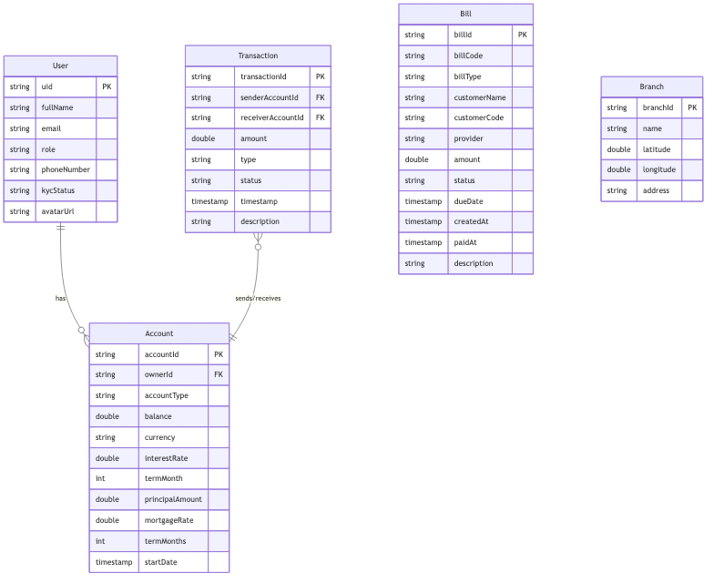

# TDTU Mobile Banking

A comprehensive mobile banking application for Android built with modern technologies and best practices. This application provides banking services including account management, money transfers, bill payments, branch location services, and eKYC (electronic Know Your Customer) functionality.

## Project Overview

TDTU Mobile Banking is a full-featured banking application that enables customers to manage their bank accounts, perform transactions, pay utility bills, and locate nearby bank branches. The application supports multiple account types (Checking, Saving, and Mortgage accounts) and includes role-based access for both customers and bank officers.

### Key Features

- **User Authentication**: Secure login with Firebase Authentication
- **Account Management**: View and manage multiple bank accounts (Checking, Saving, Mortgage)
- **Money Transfers**: Internal and external money transfers with OTP verification
- **Bill Payments**: Pay utility bills with Stripe payment integration
- **Branch Locator**: Find nearby bank branches using Google Maps
- **eKYC**: Electronic Know Your Customer verification using CameraX
- **Role-Based Access**: Separate interfaces for customers and bank officers
- **Transaction History**: View detailed transaction records
- **Interest Rate Management**: Bank officers can update interest rates for savings accounts

## Technology Stack

### Core Technologies
- **Kotlin**: Primary programming language
- **Android SDK**: Minimum SDK 24, Target SDK 36
- **Jetpack Compose**: Modern declarative UI framework
- **Material Design 3**: Modern UI components

### Architecture & Patterns
- **MVVM (Model-View-ViewModel)**: Clean architecture pattern
- **Repository Pattern**: Data abstraction layer
- **Use Cases**: Business logic encapsulation
- **Dependency Injection**: Hilt for DI

### Libraries & Frameworks

#### UI & Navigation
- Jetpack Compose
- Navigation Compose
- Material 3
- Coil (Image loading)

#### Dependency Injection
- Hilt (Dagger Hilt)

#### Backend Services
- **Firebase Authentication**: User authentication
- **Cloud Firestore**: NoSQL database
- **Firebase Storage**: File storage for KYC documents
- **Firebase Analytics**: Usage analytics

#### Networking
- Retrofit: HTTP client
- OkHttp: HTTP client with logging
- Moshi: JSON serialization

#### Payment Processing
- Stripe Android SDK: Payment processing
- Custom Stripe backend server (Node.js/Express)

#### Location & Maps
- Google Maps SDK
- Google Play Services Location

#### Camera & Media
- CameraX: Camera functionality for eKYC

#### Data Persistence
- DataStore Preferences: Local data storage

#### Coroutines
- Kotlin Coroutines: Asynchronous programming

## Project Structure

```
app/src/main/java/com/example/tdtumobilebanking/
├── core/                    # Core utilities and common components
│   ├── common/             # Base classes and common states
│   ├── di/                 # Dependency injection modules
│   └── util/               # Utility functions
├── data/                   # Data layer
│   ├── mapper/             # Data mappers (DTO to Domain)
│   ├── remote/             # Remote data sources
│   │   ├── api/           # API interfaces
│   │   └── dto/           # Data Transfer Objects
│   ├── repository/        # Repository implementations
│   └── seed/              # Data seeding utilities
├── domain/                 # Domain layer (business logic)
│   ├── model/             # Domain models
│   ├── repository/        # Repository interfaces
│   └── usecase/           # Use cases
│       ├── account/       # Account-related use cases
│       ├── auth/         # Authentication use cases
│       ├── transaction/  # Transaction use cases
│       └── user/         # User-related use cases
├── presentation/           # Presentation layer (UI)
│   ├── auth/             # Authentication screens
│   ├── dashboard/        # Dashboard screens
│   ├── transactions/     # Transaction screens
│   ├── billpayment/      # Bill payment screens
│   ├── branches/         # Branch location screens
│   ├── kyc/              # KYC verification screens
│   ├── officer/          # Bank officer screens
│   ├── profile/          # User profile screens
│   ├── utilities/        # Utility payment screens
│   └── navigation/       # Navigation configuration
└── ui/                    # UI theme and styling
    └── theme/            # Color, typography, and theme
```

## Database Schema

The application uses Firebase Firestore as the backend database. The database schema includes the following main collections:

### Entity Relationship Diagram



### Class Diagram


### Main Entities

- **User**: User information including authentication details, KYC status, and role
- **Account**: Bank accounts (Checking, Saving, Mortgage) with balance and account details
- **Transaction**: Transaction records with sender, receiver, amount, type, and status
- **Bill**: Utility bills with provider information, amount, and payment status
- **Branch**: Bank branch locations with coordinates and address information

## Installation

### Prerequisites

- Android Studio Hedgehog (2023.1.1) or later
- JDK 17 or later
- Android SDK with API level 24 or higher
- Google account for Firebase setup
- Stripe account (for payment functionality)

### Setup Instructions

1. **Clone the repository**
   ```bash
   git clone https://github.com/iannwendy/TDTUiBankingApp.git
   cd TDTUMobileBanking
   ```

2. **Firebase Configuration**
   - Create a Firebase project at [Firebase Console](https://console.firebase.google.com/)
   - Download `google-services.json` and place it in the `app/` directory
   - Enable the following Firebase services:
     - Authentication (Email/Password)
     - Cloud Firestore
     - Firebase Storage
     - Firebase Analytics

3. **Google Maps API Key**
   - Obtain a Google Maps API key from [Google Cloud Console](https://console.cloud.google.com/)
   - Add the API key to `local.properties`:
     ```properties
     MAPS_API_KEY=your_maps_api_key_here
     ```
   - The API key will be automatically injected into the app

4. **Stripe Backend Setup**
   - Navigate to the `stripe_backend/` directory
   - Install dependencies:
     ```bash
     cd stripe_backend
     npm install
     ```
   - Create a `.env` file with your Stripe secret key:
     ```env
     STRIPE_SECRET_KEY=your_stripe_secret_key_here
     ```
   - The backend server will automatically start when building the debug version
   - Alternatively, start it manually:
     ```bash
     npm start
     ```
   - The server runs on `http://localhost:4242`

5. **Build the Project**
   - Open the project in Android Studio
   - Sync Gradle files
   - Build the project:
     ```bash
     ./gradlew build
     ```

6. **Run the Application**
   - Connect an Android device or start an emulator
   - Run the app from Android Studio or use:
     ```bash
     ./gradlew installDebug
     ```

### Additional Configuration

- **Network Security**: The app includes a network security config to allow cleartext traffic for local development
- **Permissions**: The app requires the following permissions:
  - Internet
  - Camera (for eKYC)
  - Location (for branch locator)

## Demo Accounts

For testing purposes, the following demo accounts are available:

- **Bank Officer Account**:
  - Email: `off@gmail.com`
  - Password: `pass123`

- **Customer Account**:
  - Email: `test01@gmail.com`
  - Password: `pass123`

These accounts can be used to test different user roles and functionalities within the application.

## Development

### Running Tests
```bash
./gradlew test
```

### Building Release APK
```bash
./gradlew assembleRelease
```

### Stripe Backend Management
- Start backend: `./gradlew startStripeBackend`
- Stop backend: `./gradlew stopStripeBackend`
- Check status: `./gradlew checkStripeBackend`

## Features in Detail

### Account Types

1. **Checking Account**: Standard checking account with optional overdraft limit
2. **Saving Account**: Interest-bearing account with configurable interest rate and term
3. **Mortgage Account**: Mortgage account with principal amount and mortgage rate

### Transaction Types

- Internal Transfer: Transfer between accounts within the same bank
- External Transfer: Transfer to accounts in other banks
- Bill Payment: Payment for utility bills
- Deposit: Money deposit to account
- Withdrawal: Money withdrawal from account

### Security Features

- OTP (One-Time Password) verification for sensitive transactions
- Firebase Authentication for secure user login
- KYC verification for customer identity
- Encrypted data transmission

## Contributing

This is a private project. For any questions or issues, please contact the repository owner.

## Notes

- The application uses Firebase Firestore for real-time data synchronization
- Stripe backend server must be running for payment functionality
- Google Maps API key is required for branch location features
- Camera permission is required for eKYC functionality

