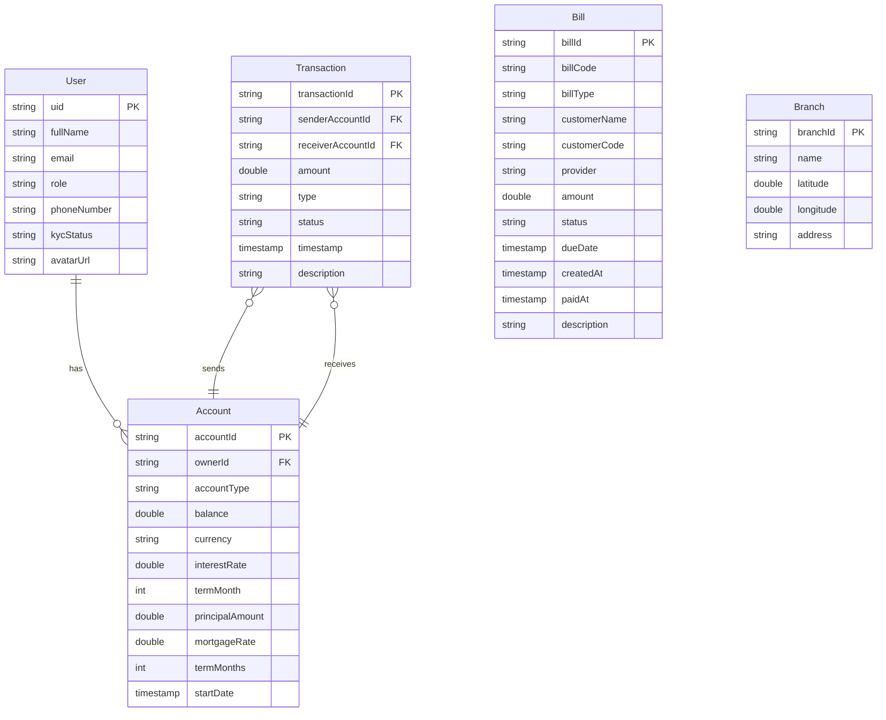

# TDTU Mobile Banking - Entity Relationship Diagram

## Database Schema

Ứng dụng sử dụng Firebase Firestore làm database. Dưới đây là cấu trúc các collection và mối quan hệ giữa chúng.

## ERD Diagram

## Collections

### User (Collection: `users`)

| Field | Type | Constraints |
|-------|------|-------------|
| `uid` | `string` | PK |
| `fullName` | `string` | - |
| `email` | `string` | - |
| `role` | `string` | - |
| `phoneNumber` | `string` | - |
| `kycStatus` | `enum (VERIFIED, PENDING, NONE)` | - |
| `avatarUrl` | `string` | - |

### Account (Collection: `accounts`)

| Field | Type | Constraints |
|-------|------|-------------|
| `accountId` | `string` | PK |
| `ownerId` | `string` | FK -> User.uid |
| `accountType` | `enum (CHECKING, SAVING, MORTGAGE)` | - |
| `balance` | `double` | - |
| `currency` | `string` | - |
| `interestRate` | `double` | nullable |
| `termMonth` | `int` | nullable |
| `principalAmount` | `double` | nullable |
| `mortgageRate` | `double` | nullable |
| `termMonths` | `int` | nullable |
| `startDate` | `timestamp` | nullable |

### Transaction (Collection: `transactions`)

| Field | Type | Constraints |
|-------|------|-------------|
| `transactionId` | `string` | PK |
| `senderAccountId` | `string` | FK -> Account.accountId |
| `receiverAccountId` | `string` | FK -> Account.accountId |
| `amount` | `double` | - |
| `type` | `enum (TRANSFER_INTERNAL, TRANSFER_EXTERNAL, BILL_PAYMENT, DEPOSIT, WITHDRAWAL)` | - |
| `status` | `enum (SUCCESS, FAILED)` | - |
| `timestamp` | `timestamp` | - |
| `description` | `string` | - |

### Bill (Collection: `bills`)

| Field | Type | Constraints |
|-------|------|-------------|
| `billId` | `string` | PK |
| `billCode` | `string` | - |
| `billType` | `string` | - |
| `customerName` | `string` | - |
| `customerCode` | `string` | - |
| `provider` | `string` | - |
| `amount` | `double` | - |
| `status` | `enum (UNPAID, PAID, OVERDUE, CANCELLED)` | - |
| `dueDate` | `timestamp` | - |
| `createdAt` | `timestamp` | - |
| `paidAt` | `timestamp` | nullable |
| `description` | `string` | - |

### Branch (Collection: `branches`)

| Field | Type | Constraints |
|-------|------|-------------|
| `branchId` | `string` | PK |
| `name` | `string` | - |
| `latitude` | `double` | - |
| `longitude` | `double` | - |
| `address` | `string` | - |

## Relationships

- **User.uid** → **Account.ownerId** (one-to-many)
  - Relationship: has

- **Transaction.senderAccountId** → **Account.accountId** (many-to-one)
  - Relationship: sends

- **Transaction.receiverAccountId** → **Account.accountId** (many-to-one)
  - Relationship: receives
